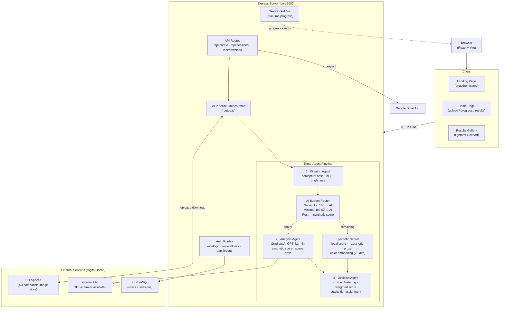

# Currotter — AI Photo Curator

Currotter is an AI-powered photo curation web application that automatically removes duplicates, blurry shots, and low-quality images from your event photo collections. Upload up to 250 photos and get back only the best ones, ranked by a three-agent AI pipeline with quality tiers.

---

## Architecture

### System Architecture



### AI Pipeline Flow


---

## Getting Started

### Prerequisites

- Node.js 20+
- PostgreSQL 14+
- [DigitalOcean Spaces](https://www.digitalocean.com/products/spaces) bucket for temporary image storage
- [DigitalOcean Gradient AI](https://www.digitalocean.com/products/ai) API key for vision-based scoring

### Installation

```bash
git clone <repository-url>
cd currotter
npm install
cp .env.template .env   # fill in your credentials
npm run db:push
npm run dev
```

The app will be available at `http://localhost:5000`.

### Environment Variables

Copy `.env.template` ke `.env` dan isi nilainya.

| Variable | Description |
|---|---|
| `DO_SPACES_KEY` | DigitalOcean Spaces access key ID |
| `DO_SPACES_SECRET` | DigitalOcean Spaces secret access key |
| `DO_SPACES_ENDPOINT` | Spaces endpoint (e.g. `nyc3.digitaloceanspaces.com`) |
| `DO_SPACES_BUCKET` | Spaces bucket name |
| `GRADIENT_API_KEY` | DigitalOcean Gradient AI API key |
| `SESSION_SECRET` | Random secret (min 32 chars) for session encryption |
| `DATABASE_URL` | PostgreSQL connection string (auto-provisioned on Replit) |
| `GOOGLE_CLIENT_ID` | Google OAuth Client ID — for per-user Google Drive export |
| `GOOGLE_CLIENT_SECRET` | Google OAuth Client Secret — for per-user Google Drive export |

### Build for Production

```bash
npm run build
npm start
```

---

## Features

### Authentication

- **Replit Auth (OpenID Connect)** — Secure login via Replit's OIDC provider. All API endpoints require authentication.
- **Session management** — PostgreSQL-backed session store with automatic token refresh.

### Upload & Curation

- **Drag-and-Drop Upload** — Drop up to **250 images** (10 MB each) or click to browse. A thumbnail preview grid shows all selected files with individual sizes, a total size counter, and an estimated processing time before you start.
- **Two Curation Modes**:
  - **Social** — More photos, variety-focused. Selects up to 2 images per visual cluster. AI analyzes the top 100 photos.
  - **Minimal** — Only the absolute best shots. Selects 1 image per cluster. AI analyzes the top 60 photos.

### AI Pipeline (Three-Agent System)

1. **Filtering Agent** — Detects and removes duplicate photos using perceptual hashing with bit-level Hamming distance. Flags blurry images (Laplacian variance) and photos with extreme brightness. Computes a local quality score (blur 60% + brightness 40%) to pre-rank images before AI scoring.

2. **Analysis Agent** — Applies a smart AI budget: the top-ranked photos (by local score) are sent to DigitalOcean Gradient AI (GPT-4.1-mini) for aesthetic scoring and scene description. Remaining photos receive a synthetic score derived from local metrics and a real 76-dimensional color embedding — so the clustering algorithm still works well with zero extra API cost.

3. **Decision Agent** — Groups visually similar images into clusters using cosine similarity on embeddings. Selects the best-scoring images from each cluster. Assigns a **quality tier** to each selected photo:
   - **Hero** — top 15% by final score
   - **Great** — next 35%
   - **Good** — remainder

### Quality Tiers & Selection Reasons

- Hero and Great badges appear on gallery cards and in the lightbox.
- Photos scored without AI analysis show a "Local score" label in the lightbox.
- Every curated photo includes a human-readable explanation of why it was selected.

### Real-Time Progress

- Live progress updates via WebSocket as images move through each pipeline stage.
- Fallback HTTP polling activates automatically if WebSocket is unavailable.

### Results & Export

- **Curated Gallery** — Responsive grid, sorted by score with a name toggle. Keyboard navigation in lightbox (← → Esc).
- **ZIP Download** — Download all curated photos in one click.
- **Google Drive Export** — Save directly to Drive; button becomes an "Open in Drive" link after export.

### Dark / Light Theme

- Toggle between dark and light themes; preference is saved across sessions.

---

## Pages

| Route | State | Description |
|---|---|---|
| `/` | unauthenticated | Landing page with hero, feature cards, how-it-works |
| `/` | authenticated | Upload → Processing → Results flow |
| `/terms` | any | Terms & Conditions |
| `/privacy` | any | Privacy Policy |

---

## Tech Stack

| Layer | Technology |
|---|---|
| Frontend | React 18, TypeScript, Vite 7, Tailwind CSS, shadcn/ui, Framer Motion |
| Backend | Express 5, TypeScript |
| AI | DigitalOcean Gradient AI (GPT-4.1-mini vision model) |
| Storage | DigitalOcean Spaces (S3-compatible) |
| Database | PostgreSQL (Drizzle ORM) |
| Auth | Replit Auth (OpenID Connect) + Passport.js |
| Real-Time | WebSocket (ws) |
| Image Processing | Sharp, image-hash |
| Export | JSZip, Google Drive API (googleapis) |
| API Docs | Swagger (swagger-jsdoc + swagger-ui-express) |

---

## Project Structure

```
client/
  src/
    pages/
      home.tsx              # Main app (upload, processing, results)
      landing.tsx           # Landing page for unauthenticated users
      terms.tsx             # Terms and Conditions
      privacy.tsx           # Privacy Policy
    components/
      upload-zone.tsx       # Drag-and-drop file upload (250 files, time estimate)
      mode-selector.tsx     # Social vs Minimal mode picker
      pipeline-progress.tsx # Multi-stage processing visualization
      results-gallery.tsx   # Curated gallery: tier badges, lightbox, export
      theme-provider.tsx    # Dark/light theme context provider
      theme-toggle.tsx      # Theme toggle button
    hooks/
      use-websocket.ts      # WebSocket hook for real-time progress
      use-auth.ts           # Authentication hook
server/
  routes.ts                 # API endpoints + pipeline orchestration + AI budget
  storage.ts                # In-memory session management
  spaces.ts                 # DigitalOcean Spaces integration
  gdrive.ts                 # Google Drive export integration
  db.ts                     # PostgreSQL connection (Drizzle)
  swagger.ts                # Swagger API docs setup
  agents/
    filtering.ts            # Perceptual hashing, blur, brightness, local score
    analysis.ts             # Gradient AI vision API + synthetic scoring + embeddings
    decision.ts             # Cosine clustering, weighted scoring, quality tiers
  replit_integrations/
    auth/                   # Replit Auth (OIDC) module
shared/
  schema.ts                 # Zod schemas (ImageAnalysis + qualityTier + aiAnalyzed)
  models/
    auth.ts                 # User and session database schemas
```

---

## API Endpoints

All endpoints (except auth routes) require authentication. Interactive docs at `/api-docs`.

| Method | Endpoint | Description |
|---|---|---|
| `GET` | `/api/login` | Initiates the OIDC login flow |
| `GET` | `/api/callback` | OIDC callback handler |
| `GET` | `/api/logout` | Logs out and ends the session |
| `GET` | `/api/auth/user` | Returns the current authenticated user |
| `POST` | `/api/curate` | Upload images (up to 250) and start the curation pipeline |
| `GET` | `/api/sessions/:id` | Get session status and results |
| `GET` | `/api/sessions/:id/download` | Download curated images as a ZIP |
| `POST` | `/api/sessions/:id/export-drive` | Export curated images to Google Drive |
| `WS` | `/ws` | WebSocket for real-time progress updates |

---

## License

MIT
