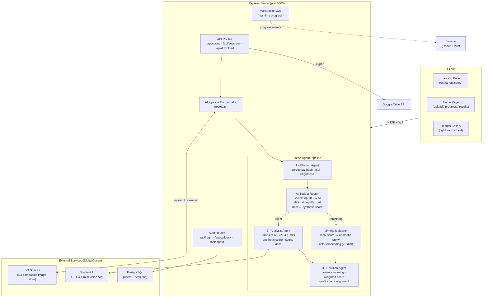

<div align="center">


# Currotter — AI Photo Curator

**Drop your event photos. Let the otter pick the best ones.**

Currotter is an AI-powered photo curation app that automatically removes duplicates, blurry shots, and low-quality images from your event photo collections. Upload up to 250 photos and get back only the best ones — ranked by a three-agent AI pipeline and organized into quality tiers.

[](https://react.dev)
[](https://expressjs.com)
[](https://typescriptlang.org)
[](https://www.digitalocean.com)

</div>

---

## What is Currotter?


Event photographers and hobbyists know the pain: you come back from a birthday party, conference, or trip with **hundreds of photos** — many of them duplicates, blurry, or poorly lit. Manually sorting through them takes hours.

Currotter solves this. You upload your photos, choose a curation mode, and the AI pipeline does the rest in minutes. It returns a clean, curated album where every photo earns its place — complete with quality badges and human-readable explanations for why each shot was kept.

### Key Highlights

- **Up to 250 photos** per session with drag-and-drop upload
- **Two curation modes** — *Social* (more variety) and *Minimal* (only the absolute best)
- **Three-agent AI pipeline** — filtering, analysis, and decision-making
- **Smart AI budget** — only top-ranked photos hit the vision API; the rest are scored locally at zero cost
- **Quality tiers** — Hero, Great, and Good badges on every curated photo
- **Real-time progress** via WebSocket
- **Export** — ZIP download or one-click Google Drive export
- **Dark / Light theme** with persistent preference

---

## How It Works

The curation pipeline runs in three stages, each handled by a specialized AI agent:

<div align="center">

&nbsp;&nbsp;&nbsp;&nbsp;

&nbsp;&nbsp;&nbsp;&nbsp;

</div>

<br />

### Stage 1 — Filtering Agent

Removes the obvious throwaways before anything touches the AI API:

- **Duplicate detection** — Perceptual hashing with Hamming distance (≤30 bits = duplicate)
- **Blur detection** — Laplacian variance analysis (threshold 100)
- **Brightness check** — Flags photos that are too dark (< 0.08) or overexposed (> 0.95)
- **Local score** — Pre-ranks every surviving photo by blur (60%) + brightness (40%)

### Stage 2 — Analysis Agent

Applies a smart AI budget to keep costs under control:

| Mode | Photos sent to AI | Remaining photos |
|------|-------------------|------------------|
| **Social** | Top 100 by local score | Scored synthetically |
| **Minimal** | Top 60 by local score | Scored synthetically |

- **AI path** — GPT-4.1-mini vision (via DigitalOcean Gradient AI) returns an aesthetic score (0–1), scene description, and a 76-dimensional embedding
- **Synthetic path** — Local metrics are converted to an aesthetic proxy with a real color histogram embedding — so clustering still works, with zero extra API cost

### Stage 3 — Decision Agent

Groups and selects the final curated set:

- **Cosine similarity clustering** on embeddings (threshold: Social 0.90, Minimal 0.80)
- **Weighted scoring** — focus, aesthetics, uniqueness, brightness
- **Best-per-cluster selection** — Social picks up to 2 per cluster, Minimal picks 1
- **Quality tier assignment**:
  - **Hero** — top 15% by final score
  - **Great** — next 35%
  - **Good** — remainder

---

## Architecture

### System Architecture



### AI Pipeline Flow

```mermaid
flowchart LR
    Upload(["User uploads\n1–250 photos"])

    subgraph Stage1["Stage 1 · Filtering Agent"]
        Hash["Perceptual Hash\nHamming distance\n≤30 bits = duplicate"]
        Blur["Blur Detection\nLaplacian variance\nthreshold 100"]
        Bright["Brightness Check\n< 0.08 too dark\n> 0.95 overexposed"]
        LocalScore["Local Score\nblur 60% + brightness 40%\n→ pre-rank order"]
    end

    subgraph Stage2["Stage 2 · Analysis Agent"]
        BudgetSplit{{"AI Budget Split"}}
        AIPath["AI Analysis\nGPT-4.1-mini vision\naesthetic score 0–1\nscene description\n76-dim embedding"]
        SynthPath["Synthetic Scoring\nlocal score → aesthetic proxy\ncolor histogram embedding\n(no API call)"]
    end

    subgraph Stage3["Stage 3 · Decision Agent"]
        Cluster["Cosine Similarity\nClustering\nSocial 0.90 · Minimal 0.80"]
        Score["Weighted Scoring\nfocus · aesthetic\nuniqueness · brightness"]
        Select["Best-per-Cluster\nSocial: 2/cluster\nMinimal: 1/cluster"]
        Tiers["Quality Tier\nHero top 15%\nGreat top 35%\nGood remainder"]
    end

    Results(["Curated Album\nwith tiers + reasons"])

    Upload --> Stage1
    Hash --> Blur --> Bright --> LocalScore
    LocalScore --> BudgetSplit
    BudgetSplit -->|"top 100 Social\ntop 60 Minimal"| AIPath
    BudgetSplit -->|"remaining photos"| SynthPath
    AIPath --> Cluster
    SynthPath --> Cluster
    Cluster --> Score --> Select --> Tiers --> Results
```



---

## Tech Stack

| Layer | Technology |
|---|---|
| **Frontend** | React 18, TypeScript, Vite 7, Tailwind CSS, shadcn/ui, Framer Motion |
| **Backend** | Express 5, TypeScript |
| **AI** | DigitalOcean Gradient AI (GPT-4.1-mini vision model) |
| **Storage** | DigitalOcean Spaces (S3-compatible) |
| **Database** | PostgreSQL (Drizzle ORM) |
| **Auth** | Passport.js (local strategy) |
| **Real-Time** | WebSocket (ws) |
| **Image Processing** | Sharp, image-hash |
| **Export** | JSZip, Google Drive API (googleapis) |
| **API Docs** | Swagger (swagger-jsdoc + swagger-ui-express) |

---

## Project Structure

```
client/
  src/
    pages/
      home.tsx              # Main app (upload, processing, results)
      landing.tsx           # Landing page for unauthenticated users
      terms.tsx             # Terms and Conditions
      privacy.tsx           # Privacy Policy
    components/
      upload-zone.tsx       # Drag-and-drop file upload (250 files, time estimate)
      mode-selector.tsx     # Social vs Minimal mode picker
      pipeline-progress.tsx # Multi-stage processing visualization
      results-gallery.tsx   # Curated gallery: tier badges, lightbox, export
      theme-provider.tsx    # Dark/light theme context provider
      theme-toggle.tsx      # Theme toggle button
    hooks/
      use-websocket.ts      # WebSocket hook for real-time progress
      use-auth.ts           # Authentication hook
server/
  routes.ts                 # API endpoints + pipeline orchestration + AI budget
  storage.ts                # In-memory session management
  spaces.ts                 # DigitalOcean Spaces integration
  gdrive.ts                 # Google Drive export integration
  db.ts                     # PostgreSQL connection (Drizzle)
  swagger.ts                # Swagger API docs setup
  agents/
    filtering.ts            # Perceptual hashing, blur, brightness, local score
    analysis.ts             # Gradient AI vision API + synthetic scoring + embeddings
    decision.ts             # Cosine clustering, weighted scoring, quality tiers
shared/
  schema.ts                 # Zod schemas (ImageAnalysis + qualityTier + aiAnalyzed)
  models/
    auth.ts                 # User and session database schemas
```

---

## Pages

| Route | State | Description |
|---|---|---|
| `/` | unauthenticated | Landing page with hero, feature cards, how-it-works |
| `/` | authenticated | Upload → Processing → Results flow |
| `/terms` | any | Terms & Conditions |
| `/privacy` | any | Privacy Policy |

---

## API Endpoints

All endpoints (except auth routes) require authentication. Interactive docs available at `/api-docs`.

| Method | Endpoint | Description |
|---|---|---|
| `GET` | `/api/login` | Initiates the login flow |
| `GET` | `/api/callback` | Auth callback handler |
| `GET` | `/api/logout` | Logs out and ends the session |
| `GET` | `/api/auth/user` | Returns the current authenticated user |
| `POST` | `/api/curate` | Upload images (up to 250) and start the curation pipeline |
| `GET` | `/api/sessions/:id` | Get session status and results |
| `GET` | `/api/sessions/:id/download` | Download curated images as a ZIP |
| `POST` | `/api/sessions/:id/export-drive` | Export curated images to Google Drive |
| `WS` | `/ws` | WebSocket for real-time progress updates |

---

## Development Story


Currotter was originally built and iterated on **Replit**, where the entire application — frontend, backend, AI pipeline, database — was developed from the ground up. The platform made it easy to prototype quickly and test the multi-agent pipeline in a live environment.

When it came time to move to production infrastructure, the **migration to DigitalOcean took only about 2 hours**. The app was deployed on a DigitalOcean Droplet with a managed PostgreSQL database, Spaces for image storage, and Gradient AI for the vision API — all within the same ecosystem. The clean separation between client, server, and external services made the transition smooth and fast.

---

## Getting Started

### Prerequisites

- **Node.js** 20+
- **PostgreSQL** 14+
- **DigitalOcean Spaces** bucket — for temporary image storage ([create one here](https://www.digitalocean.com/products/spaces))
- **DigitalOcean Gradient AI** API key — for vision-based scoring ([get a key here](https://www.digitalocean.com/products/ai))

### Installation

```bash
# Clone the repository
git clone <repository-url>
cd currotter

# Install dependencies
npm install

# Set up environment variables
cp .env.template .env
# Open .env and fill in your credentials (see table below)

# Push database schema
npm run db:push

# Start development server
npm run dev
```

The app will be available at `http://localhost:5000`.

### Environment Variables

Copy `.env.template` to `.env` and fill in the values:

| Variable | Description |
|---|---|
| `DO_SPACES_KEY` | DigitalOcean Spaces access key ID |
| `DO_SPACES_SECRET` | DigitalOcean Spaces secret access key |
| `DO_SPACES_ENDPOINT` | Spaces endpoint (e.g. `nyc3.digitaloceanspaces.com`) |
| `DO_SPACES_BUCKET` | Spaces bucket name |
| `GRADIENT_API_KEY` | DigitalOcean Gradient AI API key |
| `SESSION_SECRET` | Random secret (min 32 chars) for session encryption |
| `DATABASE_URL` | PostgreSQL connection string |
| `GOOGLE_CLIENT_ID` | Google OAuth Client ID — for Google Drive export |
| `GOOGLE_CLIENT_SECRET` | Google OAuth Client Secret — for Google Drive export |

### Build for Production

```bash
npm run build
npm start
```

---

## License

MIT
