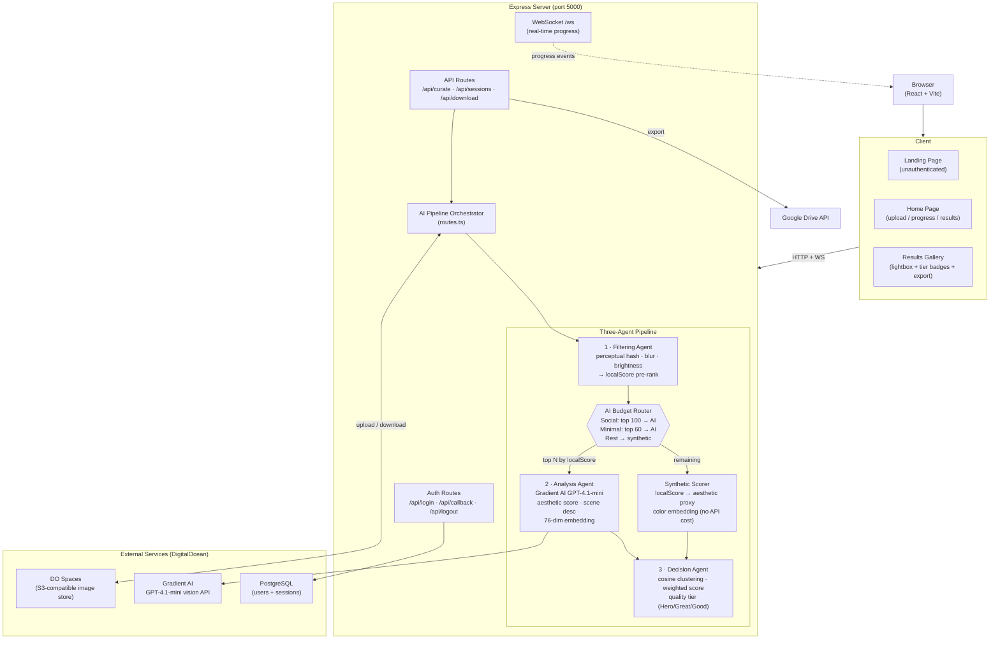

# Currotter — AI Photo Curator

## Overview
Currotter is an AI-powered photo curation web app that removes duplicates, blurry, and low-quality images from event photo collections, then returns a curated album of the best shots. It supports up to 250 photos per session and uses a smart AI budget system to control cost while maintaining quality. A three-agent pipeline filters, analyzes, and ranks photos.

---

## Architecture

### System Architecture

### AI Pipeline Flow

```mermaid
flowchart LR
    Upload(["User uploads\n1–250 photos"])

    subgraph Stage1["Stage 1 · Filtering Agent"]
        Hash["Perceptual Hash\nHamming distance\n≤30 bits = duplicate"]
        Blur["Blur Detection\nLaplacian variance\nthreshold 100"]
        Bright["Brightness Check\n< 0.08 too dark\n> 0.95 overexposed"]
        LocalScore["Local Score\nblur 60% + brightness 40%\n→ pre-rank order"]
    end

    subgraph Stage2["Stage 2 · Analysis Agent"]
        BudgetSplit{{"AI Budget Split"}}
        AIPath["AI Analysis\nGPT-4.1-mini vision\naesthetic score 0–1\nscene description\n76-dim embedding"]
        SynthPath["Synthetic Scoring\nlocal score → aesthetic proxy\ncolor histogram embedding\n(no API call)"]
    end

    subgraph Stage3["Stage 3 · Decision Agent"]
        Cluster["Cosine Similarity\nClustering\nSocial 0.90 · Minimal 0.80"]
        Score["Weighted Scoring\nfocus · aesthetic\nuniqueness · brightness"]
        Select["Best-per-Cluster\nSocial: 2/cluster\nMinimal: 1/cluster"]
        Tiers["Quality Tier\nHero top 15%\nGreat top 35%\nGood remainder"]
    end

    Results(["Curated Album\nwith tiers + reasons"])

    Upload --> Stage1
    Hash --> Blur --> Bright --> LocalScore
    LocalScore --> BudgetSplit
    BudgetSplit -->|"top 100 Social\ntop 60 Minimal"| AIPath
    BudgetSplit -->|"remaining photos"| SynthPath
    AIPath --> Cluster
    SynthPath --> Cluster
    Cluster --> Score --> Select --> Tiers --> Results
```

---

## Module Map

### Frontend (React + TypeScript + Vite)
- **Pages**: `client/src/pages/home.tsx` — Main upload/processing/results page
- **Components**:
  - `upload-zone.tsx` — Drag-and-drop upload (250 files, 10 MB each, time estimate)
  - `mode-selector.tsx` — Social vs Minimal curation mode picker
  - `pipeline-progress.tsx` — Multi-stage processing visualization
  - `results-gallery.tsx` — Curated gallery: Hero/Great/Good tier badges, lightbox with keyboard nav, individual download, sort toggle
  - `theme-provider.tsx` / `theme-toggle.tsx` — Dark/light mode

### Backend (Express + TypeScript)
- **API Routes**: `server/routes.ts` — Upload (250 files / 10 MB), AI budget logic, session status, ZIP download, Google Drive export
- **Google Drive**: `server/gdrive.ts` — Google Drive integration via Replit connector
- **Agent Pipeline** (`server/agents/`):
  1. **Filtering Agent** (`filtering.ts`) — Perceptual hashing (duplicates), Laplacian blur detection, brightness scoring, `localScore` computation
  2. **Analysis Agent** (`analysis.ts`) — Gradient AI vision API; exports `generateVisualEmbedding` for synthetic results
  3. **Decision Agent** (`decision.ts`) — Cosine similarity clustering, weighted scoring, best-per-cluster selection, `qualityTier` assignment
- **Storage**: `server/storage.ts` — In-memory session management
- **Spaces**: `server/spaces.ts` — DigitalOcean Spaces (S3-compatible) for temporary image storage

### Authentication (Replit Auth via OpenID Connect)
- **Auth Module**: `server/replit_integrations/auth/`
  - `replitAuth.ts` — OIDC setup, login/callback/logout routes, token refresh, `isAuthenticated` middleware
  - `storage.ts` — User upsert/get via Drizzle ORM
  - `routes.ts` — `/api/auth/user` endpoint
- **Database**: `server/db.ts` — PostgreSQL via Drizzle ORM
- **Auth Models**: `shared/models/auth.ts` — `users` and `sessions` tables
- **Frontend Hook**: `client/src/hooks/use-auth.ts` — `useAuth()` hook
- **Pages**: `client/src/pages/landing.tsx` — Landing page for unauthenticated users

### Shared Types
- `shared/schema.ts` — Zod schemas for `ImageAnalysis` (includes `qualityTier`, `aiAnalyzed`), `UploadSession`, `ProgressUpdate`, `CurateRequest`

---

## Key Technical Details

### AI Budget System
- After filtering, photos are sorted by `localScore` (blur 60% + brightness 40%).
- Only the top-ranked photos go to the Gradient AI API: **100 for Social, 60 for Minimal**.
- The remaining photos receive a **synthetic score**: `aestheticScore = localScore × 0.82 + 0.1`, plus a real 76-dim color embedding computed locally.
- This means the clustering and decision steps work correctly for all photos, with API calls bounded regardless of upload size.

### Quality Tiers
- After cluster selection, `makeDecisions()` ranks selected photos by `finalScore`.
- Top 15% → `"hero"`, next 35% → `"great"`, remainder → `"good"`.
- Tiers are stored in `ImageAnalysis.qualityTier` and shown as badges in the gallery.

### Curation Modes
- **Social**: 2 photos per cluster, cosine similarity threshold 0.90, AI cap 100
- **Minimal**: 1 photo per cluster, cosine similarity threshold 0.80, AI cap 60

### WebSocket
- `/ws` endpoint for real-time progress updates during processing
- HTTP polling fallback activates automatically when WebSocket is unavailable

---

## Environment Variables (Secrets)
- `DO_SPACES_KEY` — DigitalOcean Spaces access key
- `DO_SPACES_SECRET` — DigitalOcean Spaces secret key
- `DO_SPACES_ENDPOINT` — Spaces endpoint
- `DO_SPACES_BUCKET` — Spaces bucket name
- `GRADIENT_API_KEY` — DigitalOcean Gradient AI API key
- `SESSION_SECRET` — Express session encryption key
- `DATABASE_URL` — PostgreSQL connection string (auto-provisioned on Replit)

### Optional — Auth0 (for non-Replit deployment)
When `AUTH0_DOMAIN` is set, the app switches from Replit OIDC to Auth0:
- `AUTH0_DOMAIN` — Auth0 tenant domain, e.g. `dev-xxx.us.auth0.com`
- `AUTH0_CLIENT_ID` — Auth0 Application Client ID
- `AUTH0_CLIENT_SECRET` — Auth0 Application Client Secret

### Optional — Google Drive (for non-Replit deployment)
When set, replaces the Replit Connector-based Google Drive integration:
- `GOOGLE_CLIENT_ID` — Google OAuth 2.0 Client ID
- `GOOGLE_CLIENT_SECRET` — Google OAuth 2.0 Client Secret
- `GOOGLE_REFRESH_TOKEN` — Pre-authorized refresh token for the export Google account

## Running
- `npm run dev` starts both Express backend and Vite frontend on port 5000

---

## Recent Changes

### 2026-03-18 — Dual-mode Auth + Google Drive for DigitalOcean portability
- `server/replit_integrations/auth/replitAuth.ts` now auto-detects auth provider: uses **Auth0** when `AUTH0_DOMAIN` is set, falls back to Replit OIDC otherwise — no breakage during development
- Auth0 path: `client.discovery` with `{ client_secret }` + standard OIDC claims (`given_name`, `family_name`, `picture`)
- `server/gdrive.ts` completely rewritten: replaced Replit Connectors with direct Google OAuth2 using `GOOGLE_CLIENT_ID` + `GOOGLE_CLIENT_SECRET` + `GOOGLE_REFRESH_TOKEN` env vars (uses `googleapis` OAuth2Client directly)
- Deploy guide at `docs/deploy-digitalocean.md` updated with step-by-step Auth0 + Google Drive OAuth setup instructions

### 2026-03-13 — 250-photo support with smart AI budget
- Upload limit raised to 250 files (was 50); per-file cap lowered to 10 MB (was 20 MB)
- Smart AI budget: top 100 (Social) / top 60 (Minimal) photos → GPT-4.1-mini vision; rest → synthetic local score + color embedding (no API cost)
- Decision agent assigns `qualityTier` (hero/great/good) by score percentile (top 15% = hero, top 35% = great)
- `aiAnalyzed` flag on each `ImageAnalysis` tracks which photos used real AI
- Results gallery: Hero/Great badges on cards; lightbox shows tier + "Local score" label for non-AI photos
- Upload zone: estimated processing time display (~1 min ≤30 photos → ~4–5 min for 250)
- `shared/schema.ts`: added `qualityTier` and `aiAnalyzed` to `imageAnalysisSchema`

### 2026-03-13 — Architecture & feature improvements
- Fixed 5 TypeScript errors in `server/routes.ts` (Set/Map iteration + params type narrowing)
- Fixed URL.createObjectURL memory leak in `upload-zone.tsx`
- Removed redundant dual-progress system (WS primary, polling fallback only)
- Added dedicated error state (`AppState "error"`) with retry button in `home.tsx`
- Upload zone: file size per image, total size counter, slots-remaining warning
- Results gallery: keyboard nav (← → Esc), sort by score/name, "Best" badge, scene description + individual download in lightbox, aesthetic score display

### 2026-02-23 — Selection explanations, Google Drive, Replit Auth
- `selectionReason` on every curated photo (hover in grid + lightbox Info icon)
- Terms & Conditions (`/terms`) and Privacy Policy (`/privacy`) pages
- Google Drive export with "Save to Drive" → "Open in Drive" button flow
- Replit Auth OIDC integration, landing page, protected API endpoints, PostgreSQL session store

### 2026-02-23 — Algorithm fixes
- Perceptual hash Hamming distance now bit-level (was hex-char comparison)
- Color histogram embeddings (was raw JPEG byte sampling)
- Clustering thresholds tuned: Social 0.90, Minimal 0.80

### 2026-02-21 — Initial MVP
- Full AI pipeline, upload UI, processing visualization, results gallery
